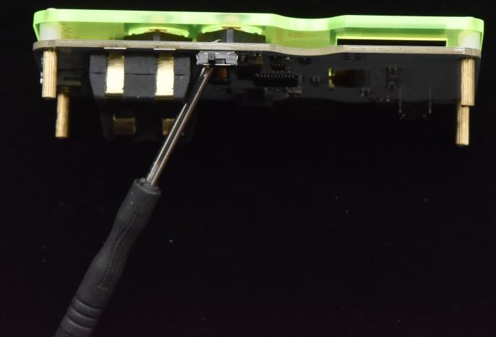
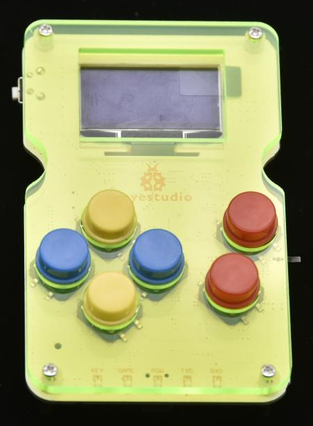

# **KS0474 Keyestudio GAMEPI DIY Game Console Learning Kit for Arduino**

## 1. Introduction

For those who like DIY, they definitely want to make their own game machine. Next, we specially introduce a game console kit. In this kit, we provide the hardware of the DIY game console. You can design your own game code to make the game console according to your ideas.

In order to increase the joy of the game console, you can upload your own game program, game program we provide, or game program on Arduboy to the game console. When using it, we offer complete software and upload method.

## 2. Parameters

-   Control chip: ATMEGA32U4

-   Display device: OLED 128\*64 1.3 inch

-   Supply voltage: DC 3V (2 AAA batteries)

## 3. Component List

| NO.  |                      Specification                       | QTY  |                           Picture                            |
| ---- | :------------------------------------------------------: | :--: | :----------------------------------------------------------: |
| 1    |      Keyestudio GAMEPI game console learning board       |  1   |      |
| 2    |                       A24 red cap                        |  2   |  |
| 3    |                      A24 yellow cap                      |  2   |  |
| 4    |                       A24 blue cap                       |  2   |  |
| 5    |                M2\*6MM round-head screws                 |  4   |  |
| 6    |                M2\*10MM round-head screws                |  4   |  |
| 7    |           M2.0\*11MM dual-pass copper pillars            |  4   |  |
| 8    |               White Insulating column ABS                |  4   |  |
| 9    |         2pcs Arduino game console acrylic shells         |  1   |  |
| 10   |                3\*83MM black screwdriver                 |  1   |      |
| 11   | M/mini5P clear blue OD:5.0 L=50cm eco-friendly USB cable |  1   |      |

## 4. Installing

When you get the product, you need to check if there are missing components according to the components list. After checking, we will start to install the game console.

(1) Take out all parts and put them together.

（2）Fix the keyestudio GAMEPI game board and acrylic top board together with 4 M2\*10MM round-head screws, 4 white insulating columns, and 4 M2.0\*11MM dual-pass copper pillars.

（3）Install 6 button caps on the GAMEPI game console board.

（4）Fix the bottom acrylic board and the four M2.0\*11MM dual-pass copper pillars together with 4 M2\*6MM round-head screws.

Special Note: The holes of acrylic bottom board should be aligned with the potentiometer on the keyestudio GAMEPI game console when installing it.

## 5.Getting started with game console

After successful installation, we can upload the game program to the game console. Before uploading the program, we need to install the driver for the game console firstly.

**5.1 Installing driver**

A. We connect the game console to the computer with a USB cable. When the computer detects the hardware, we open the device manager, as shown below.

B. Double click driver file, click “next step”, driver starts installing automatically.

C. Install driver successfully and open the device manager, as shown below.

**5.2 Downloading game program**

After installing the driver successfully, we can start uploading the game program on the game console. You can write game program by yourself, or use the game programs we provide. And the program searched in Arduboy also can be used too.

More info about links of game program you could refer to: https://arduboy.ried.cl/

Click, as shown below.

The default name with symbols can’t be used, otherwise an error will occur, we need to rename the game program with letters and numbers. After setting well, click “Download” to start downloading the game program.

**5.3 Uploading game program**

Download the software:Tap Freematics Builder 1.2.3---->Next--->Install--->Finish

Upload of program
Connect the game console to a PC. Click to find  and open the program you want to upload.

Select the console model and crystal and click when COM* port does not appear on the software

Click the COM* port and then press the reset button of the game console. The program will be uploaded automatically.

5.4 Other Functions
A. The white button on the game console is the reset button.
B. After uploading the game program successfully, we can directly press the 6 buttons to start playing the game. When playing games, we can supply power or unplug with USB cable, then we use 2 AAA batteries (3V) to supply power. When the battery is powered, we can use the DIP switch on the game console to control the power switch.
C. There is a potentiometer on the back of the game console. We can use the screwdriver to rotate the potentiometer to adjust the sound.

## 6.Resource

<https://fs.keyestudio.com/KS0474>
